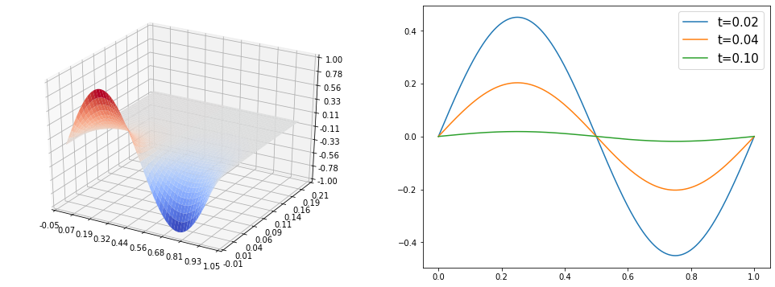
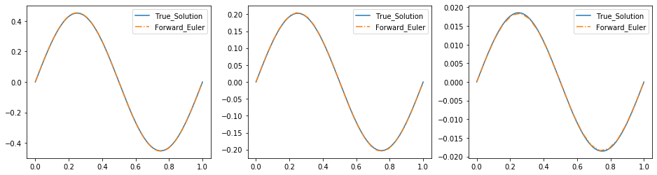

```python
import numpy as np
import scipy
import scipy.linalg
import matplotlib.pyplot as plt
from mpl_toolkits.mplot3d import Axes3D
from matplotlib import cm
from matplotlib.ticker import LinearLocator, FormatStrFormatter
```

# 向前向后欧拉法

<font size=4>
    &emsp;&emsp; 对于初值问题
    \begin{equation}
        \frac{\text{d}y}{\text{d}t} = 10y\left(1-y\right), \quad \text{for}\quad 0 < t < 1
    \end{equation}
    其中
    \begin{equation}
        y\left(0\right)=0.01
    \end{equation}
    <br>
    
<font size=4>
    &emsp;&emsp;使用向前向后欧拉法求数值解，并在同一个坐标系下画出精确解和时间节点为4，16，64，256时的数值解。

<font size=4>
    &emsp;&emsp;其真解为
    \begin{equation}
        y = \frac{e^{10t}}{e^{10t}+99}
    \end{equation}
    &emsp;&emsp;设时间节点$N$，则时间步长$\displaystyle h=\frac{1}{N-1}$，$\displaystyle t_{i}=ih=\frac{i}{N-1}$，令$y_i=y\left(t_i\right)$


```python
t = np.linspace(0,1,1000)
y = np.exp(10*t)/(np.exp(10*t)+99)
plt.figure()
plt.plot(t,y)
plt.show()
```


<font size=4> 
    &emsp;&emsp;向前欧拉法：直接迭代
    \begin{equation}
        y_{i+1}=y_{i}+h\cdot 10y_{i}\left(1-y_{i}\right), \quad i=0,1,\cdots,N-1
    \end{equation}
    其中，$y_0=0.01$
    <br>
    <br>
    <br>
    <br>
    &emsp;&emsp;向后欧拉法：隐格式，需要解方程
    \begin{equation}
        y_{i+1}=y_{i}+h\cdot 10y_{i+1}\left(1-y_{i+1}\right), \quad i=0,1,\cdots,N-1
    \end{equation}
    其中，$y_0=0.01$， 移项化简得到如下形式：
    \begin{equation}
        \left(1-10h\right)y_{i+1} + 10hy_{i+1}^2=y_{i}
    \end{equation}
    &emsp;&emsp;公式法解上述方程，并舍去负根后得到：
    \begin{equation}
        y_{i+1} = \frac{10h-1}{20h} + \frac{\sqrt{(10h-1)^2+40hy_{i}}}{20h}
    \end{equation}
    


```python
def Forward_Euler(N):
    t = np.linspace(0,1,N)
    y = [0.01]
    h = 1/(N-1)
    for i in range(N-1):
        y0 = y[-1]
        y.append( y0 + h* 10*y0*(1-y0) )
    return t,np.array(y)

def Backward_Euler(N):
    t = np.linspace(0,1,N)
    y = [0.01]
    h = 1/(N-1)
    for i in range(N-1):
        y0 = y[-1]
        y.append( (10*h-1)/(20*h) + ((10*h-1)**2+40*h*y0)**0.5/(20*h) )
    return t,np.array(y)
```


```python
# 定性 验证程序正确性
N = 2**20
ft,fy = Forward_Euler(N)
bt,by = Backward_Euler(N)
plt.figure()
plt.plot(t,y,label='True_Solution')
plt.plot(ft,fy,'-.',label='Forward_Euler')
plt.plot(bt,by,'-.',label='Backward_Euler')
plt.legend(loc=0)
plt.show()
```


# 画图


```python
plt.figure(figsize=(16,12))
for i in range(2):
    for j in range(2):
        plt.subplot(2,2,2*i+j+1)
        N = 2**(4*i+2*j+2)
        ft,fy = Forward_Euler(N)
        bt,by = Backward_Euler(N)
        tt = np.linspace(0,1,N)
        ty = np.exp(10*tt)/(np.exp(10*tt)+99)
        plt.plot(t,y,label='True Solution')
        plt.plot(ft,fy,'-.',label='Forward Euler')
        plt.plot(bt,by,'-.',label='Backward Euler')
        plt.legend(loc=0,fontsize=15)
        plt.title('N = '+str(N),fontsize=15)
plt.show()
```


```python

```


```python

```

# 热传导方程-中心差分

<font size=4>
    &emsp;&emsp;考虑热方程
    \begin{equation}
        \frac{\partial^2 u}{\partial x^2} = \frac{\partial u}{\partial t} \quad \text{for} \quad 
        \begin{cases}
            0 < x < 1\\
            0 < t < T
        \end{cases}
    \end{equation}
    初值条件
    \begin{equation}
        u\left(x,0\right) = g\left(x\right), \quad 0 \leq x \leq 1
    \end{equation}
    <br>
    &emsp;&emsp;当$\displaystyle g\left(x\right) = \sin\left(2 \pi x\right)$，精确解为$\displaystyle u\left(x,t\right) = e^{-4\pi^2t}\sin\left(2 \pi x\right)$，
    在同一坐标轴下，用中心差分格式画出精确解和$T=0.02,0.04,0.1$的数值解，时间节点取$100$，空间节点取$5,10,20$


```python
t = np.linspace(0,0.2,100)
x = np.linspace(0,1,1000)
X, T = np.meshgrid(x, t)
u = np.exp(-4*np.pi**2*T)*np.sin(2*np.pi*X)
fig = plt.figure(figsize=(17,6))

ax = fig.add_subplot(121, projection='3d')
surf = ax.plot_surface(X, T, u, cmap=cm.coolwarm)
ax.set_zlim(-1., 1.0)
ax.xaxis.set_major_locator(LinearLocator(10))
ax.yaxis.set_major_locator(LinearLocator(10))
ax.zaxis.set_major_locator(LinearLocator(10))
ax.xaxis.set_major_formatter(FormatStrFormatter('%.02f'))
ax.yaxis.set_major_formatter(FormatStrFormatter('%.02f'))
ax.zaxis.set_major_formatter(FormatStrFormatter('%.02f'))

ax = fig.add_subplot(122)
plt.plot(x,u[10,:],label='t=0.02')
plt.plot(x,u[20,:],label='t=0.04')
plt.plot(x,u[50,:],label='t=0.10')
plt.legend(loc=1,fontsize=15)

plt.show()

```





<font size=4>
    空间节点数：$\displaystyle N=5,10,20$    <br>
    空间步长：$\displaystyle h=\frac{1}{N-1}$  <br>
    时间求解域：$\displaystyle T=0.02,0.04,0.1$   <br>
    时间节点数：$\displaystyle100$       <br>
    时间步长：$\displaystyle \tau=\frac{T}{100-1}=\frac{T}{99}$    <br>
    记$x_i = ih$，$t_j = j\tau$，在$\left(x_i,t_j\right)$位置的函数值$\displaystyle u\left(x_i,t_j\right)$记为$u_i^{\left(j\right)}$
    <br>
    &emsp;&emsp;对$\left(x_i,t_j\right)$处的$\displaystyle \frac{\partial^2 u}{\partial x^2}$使用中心差分进行离散：
    \begin{equation}
        \left.\left[\frac{\partial^2 u}{\partial x^2}\right]\right|_{\left(x_i,t_j\right)} = \frac{u_{i-1}^{\left(j\right)}+u_{i+1}^{\left(j\right)}-2u_{i}^{\left(j\right)}}{h^2}
    \end{equation}
    <br>
    对$\left(x_i,t_j\right)$处的$\displaystyle \frac{\partial u}{\partial t}$使用向前差分进行离散：
    \begin{equation}
        \left.\left[\frac{\partial u}{\partial t}\right]\right|_{\left(x_i,t_j\right)} = \frac{u_{i}^{\left(j+1\right)}-u_{i}^{\left(j\right)}}{\tau}
    \end{equation}
    对$\left(x_i,t_j\right)$处的$\displaystyle \frac{\partial u}{\partial t}$使用中心差分进行离散：
    \begin{equation}
        \left.\left[\frac{\partial u}{\partial t}\right]\right|_{\left(x_i,t_j\right)} = \frac{u_{i}^{\left(j+1\right)}-u_{i}^{\left(j-1\right)}}{2\tau}
    \end{equation}
    <br>
    即
    \begin{split}
        u_{i}^{\left(j+1\right)} &= u_{i}^{\left(j\right)}+\frac{\tau}{h^2}\left(u_{i-1}^{\left(j\right)}+u_{i+1}^{\left(j\right)}-2u_{i}^{\left(j\right)}\right)\\
    &=ru_{i-1}^{\left(j\right)}+\left(1-2r\right)u_{i}^{\left(j\right)}+ru_{i+1}^{\left(j\right)}
    \end{split}
    其中$\displaystyle r=\frac{\tau}{h^2}=\frac{(N-1)^2T}{99}$
    <br>
    代入精确解可知边界恒为$0$，故
    \begin{split}
        u_{1}^{\left(j+1\right)} &= \left(1-2r\right)u_{1}^{\left(j\right)}+ru_{2}^{\left(j\right)}\\
        u_{N-1}^{\left(j+1\right)} &= ru_{N-2}^{\left(j\right)}+\left(1-2r\right)u_{N-1}^{\left(j\right)}
    \end{split}

<font size=4>
    令 $U^{\left(j\right)} = \left(u_1^{\left(j\right)},u_2^{\left(j\right)},\cdots,u_{N-1}^{\left(j\right)}\right)^T$，系数矩阵
    \begin{equation}A=
        \begin{pmatrix}
            1-2r & r   & 0   & 0   & \cdots & 0   & 0 \\
            r   & 1-2r & r   & 0   & \cdots & 0   & 0 \\
            0   & r   & 1-2r & r   & \cdots & 0   & 0 \\
            \vdots&\vdots&\vdots&\vdots&\ddots&\vdots&\vdots&\\
            0   & 0   & 0   & 0   & \cdots & r   & 1-2r \\
        \end{pmatrix}_{\left(N-2\right)\times\left(N-2\right)}
    \end{equation}
    <br>
    向前迭代可写为：
    \begin{equation}
        U^{\left(j+1\right)} = A U^{\left(j\right)}
    \end{equation}


```python
def Forward_Euler(N,T):
    r = (N-1)**2*T/99
    A = scipy.linalg.toeplitz([1-2*r,r]+[0]*(N-4))
    t = np.linspace(0,T,100)
    x = np.linspace(0,1,N)
    u0= np.sin(2*np.pi*x)
    u0[1:-1] = np.linalg.matrix_power(A,99)@u0[1:-1]
    return x,u0
```


```python
# 定性 验证程序正确性
plt.figure(figsize=(16,4))
plt.subplot(1,3,1)
fx,fu = Forward_Euler(50,0.02)
plt.plot(x,u[10,:],label='True_Solution')
plt.plot(fx,fu,'-.',label='Forward_Euler')
plt.legend(loc=0)
plt.subplot(1,3,2)
fx,fu = Forward_Euler(30,0.04)
plt.plot(x,u[20,:],label='True_Solution')
plt.plot(fx,fu,'-.',label='Forward_Euler')
plt.legend(loc=0)
plt.subplot(1,3,3)
fx,fu = Forward_Euler(20,0.10)
plt.plot(x,u[50,:],label='True_Solution')
plt.plot(fx,fu,'-.',label='Forward_Euler')
plt.legend(loc=0)
plt.show()
```





# 画图


```python
plt.figure(figsize=(16,12))
for i,T in enumerate([0.02,0.04,0.1]):
    for j,N in enumerate([5,10,20]):
        plt.subplot(3,3,3*i+j+1)
        fx,fu = Forward_Euler(N,T)
        plt.plot(x,u[int(T*500),:],label='True Solution')
        plt.plot(fx,fu,'-.',label='Forward Euler')
        plt.legend(loc=0)
        plt.title('T = %.2f,    N = %2d'%(T,N))
plt.show()
        
```


```python

```
