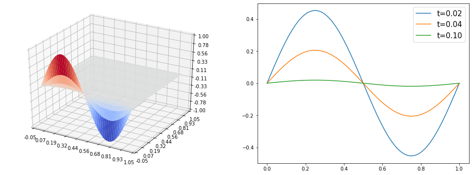
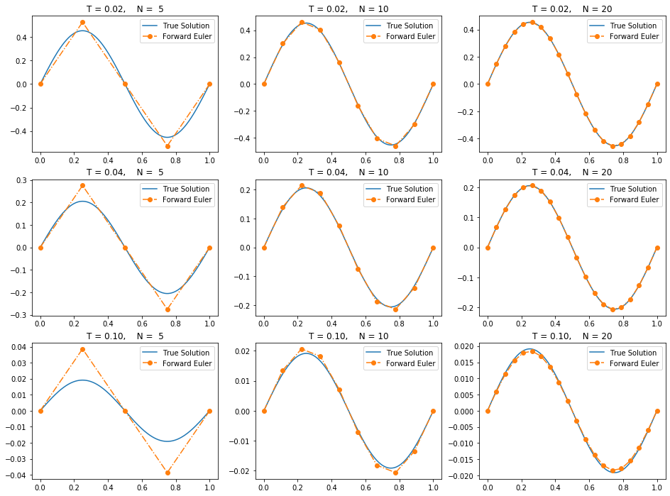

```python
import numpy as np
import scipy
import scipy.linalg
import matplotlib.pyplot as plt
from mpl_toolkits.mplot3d import Axes3D
from matplotlib import cm
from matplotlib.ticker import LinearLocator, FormatStrFormatter
```

# 向前向后欧拉法

<font size=4>
    &emsp;&emsp; 对于初值问题
    $$\frac{\text{d}y}{\text{d}t} = 10y\left(1-y\right), \quad \text{for}\quad 0 < t < 1 $$
    其中$$y\left(0\right)=0.01$$
    <br>
    
<font size=4>
    &emsp;&emsp;使用向前向后欧拉法求数值解，并在同一个坐标系下画出精确解和时间节点为4，16，64，256时的数值解。

<font size=4>
    &emsp;&emsp;其真解为$$
        y = \frac{e^{10t}}{e^{10t}+99}$$
    &emsp;&emsp;设时间节点$N$，则时间步长$\displaystyle h=\frac{1}{N-1}$，$\displaystyle t_{i}=ih=\frac{i}{N-1}$，令$y_i=y\left(t_i\right)$


```python
t = np.linspace(0,1,1000)
y = np.exp(10*t)/(np.exp(10*t)+99)
plt.figure()
plt.plot(t,y)
plt.show()
```


<font size=4> 
    &emsp;&emsp;向前欧拉法：直接迭代$$
        y_{i+1}=y_{i}+h\cdot 10y_{i}\left(1-y_{i}\right), \quad i=0,1,\cdots,N-1 $$
    其中，$y_0=0.01$
    <br>
    <br>
    &emsp;&emsp;向后欧拉法：隐格式，需要解方程$$
        y_{i+1}=y_{i}+h\cdot 10y_{i+1}\left(1-y_{i+1}\right), \quad i=0,1,\cdots,N-1$$
    其中，$y_0=0.01$， 移项化简得到如下形式：$$
        \left(1-10h\right)y_{i+1} + 10hy_{i+1}^2=y_{i}$$
    <br>
    &emsp;&emsp;公式法解上述方程，并舍去负根后得到：$$
        y_{i+1} = \frac{10h-1}{20h} + \frac{\sqrt{(10h-1)^2+40hy_{i}}}{20h}$$
    


```python
def Forward_Euler(N):
    t = np.linspace(0,1,N)
    y = [0.01]
    h = 1/(N-1)
    for i in range(N-1):
        y0 = y[-1]
        y.append( y0 + h* 10*y0*(1-y0) )
    return t,np.array(y)

def Backward_Euler(N):
    t = np.linspace(0,1,N)
    y = [0.01]
    h = 1/(N-1)
    for i in range(N-1):
        y0 = y[-1]
        y.append( (10*h-1)/(20*h) + ((10*h-1)**2+40*h*y0)**0.5/(20*h) )
    return t,np.array(y)
```


```python
# 定性 验证程序正确性
N = 2**20
ft,fy = Forward_Euler(N)
bt,by = Backward_Euler(N)
plt.figure()
plt.plot(t,y,label='True_Solution')
plt.plot(ft,fy,'-.',label='Forward_Euler')
plt.plot(bt,by,'-.',label='Backward_Euler')
plt.legend(loc=0)
plt.show()
```


### 画图


```python
plt.figure(figsize=(16,12))
for i in range(2):
    for j in range(2):
        plt.subplot(2,2,2*i+j+1)
        N = 2**(4*i+2*j+2)
        ft,fy = Forward_Euler(N)
        bt,by = Backward_Euler(N)
        tt = np.linspace(0,1,N)
        ty = np.exp(10*tt)/(np.exp(10*tt)+99)
        plt.plot(t,y,label='True Solution')
        plt.plot(ft,fy,'-.',label='Forward Euler')
        plt.plot(bt,by,'-.',label='Backward Euler')
        plt.legend(loc=0,fontsize=15)
        plt.title('N = '+str(N),fontsize=15)
plt.show()
```


```python

```


```python

```

# 热传导方程-中心差分

<font size=4>
    &emsp;&emsp;考虑热方程$$
        \frac{\partial^2 u}{\partial x^2} = \frac{\partial u}{\partial t} \quad \text{for} \quad 
        \begin{cases}
            0 < x < 1\\
            0 < t < T
        \end{cases}
        $$
    初值条件$$u\left(x,0\right) = g\left(x\right), \quad 0 \leq x \leq 1$$
    <br>
    &emsp;&emsp;当$\displaystyle g\left(x\right) = \sin\left(2 \pi x\right)$，精确解为$\displaystyle u\left(x,t\right) = e^{-4\pi^2t}\sin\left(2 \pi x\right)$，
    在同一坐标轴下，用中心差分格式画出精确解和$T=0.02,0.04,0.1$的数值解，时间节点取$100$，空间节点取$5,10,20$

## 真解形态


```python
t = np.linspace(0,1.0,500)
x = np.linspace(0,1,1000)
X, T = np.meshgrid(x, t)
u = np.exp(-4*np.pi**2*T)*np.sin(2*np.pi*X)
fig = plt.figure(figsize=(17,6))

ax = fig.add_subplot(121, projection='3d')
surf = ax.plot_surface(X, T, u, cmap=cm.coolwarm)
ax.set_zlim(-1., 1.0)
ax.xaxis.set_major_locator(LinearLocator(10))
ax.yaxis.set_major_locator(LinearLocator(10))
ax.zaxis.set_major_locator(LinearLocator(10))
ax.xaxis.set_major_formatter(FormatStrFormatter('%.02f'))
ax.yaxis.set_major_formatter(FormatStrFormatter('%.02f'))
ax.zaxis.set_major_formatter(FormatStrFormatter('%.02f'))

ax = fig.add_subplot(122)
plt.plot(x,u[10,:],label='t=0.02')
plt.plot(x,u[20,:],label='t=0.04')
plt.plot(x,u[50,:],label='t=0.10')
plt.legend(loc=1,fontsize=15)

plt.show()

```





## 离散-中心差分

<font size=4>
    空间节点数：$\displaystyle N=5,10,20$    <br>
    空间步长：$\displaystyle h=\frac{1}{N-1}$  <br>
    时间求解域：$\displaystyle T=0.02,0.04,0.1$   <br>
    时间节点数：$\displaystyle100$       <br>
    时间步长：$\displaystyle \tau=\frac{T}{100-1}=\frac{T}{99}$    <br>
    记$x_i = ih$，$t_j = j\tau$，在$\left(x_i,t_j\right)$位置的函数值$\displaystyle u\left(x_i,t_j\right)$记为$u_i^{\left(j\right)}$
    <br>
    <br>
    &emsp;&emsp;对$\left(x_i,t_j\right)$处的$\displaystyle \frac{\partial^2 u}{\partial x^2}$使用中心差分进行离散：
    $$\left.\left[\frac{\partial^2 u}{\partial x^2}\right]\right|_{\left(x_i,t_j\right)} = \frac{u_{i-1}^{\left(j\right)}+u_{i+1}^{\left(j\right)}-2u_{i}^{\left(j\right)}}{h^2}$$
    <br>
    &emsp;&emsp;对$\left(x_i,t_j\right)$处的$\displaystyle \frac{\partial u}{\partial t}$使用中心差分进行离散：
    $$\left.\left[\frac{\partial u}{\partial t}\right]\right|_{\left(x_i,t_j\right)} = \frac{u_{i}^{\left(j+1\right)}-u_{i}^{\left(j-1\right)}}{2\tau}$$
    <br>
    

<font size=4>
    即
    $$\begin{split}
        u_{i}^{\left(j+1\right)} &= u_{i}^{\left(j-1\right)}+\frac{2\tau}{h^2}\left(u_{i-1}^{\left(j\right)}+u_{i+1}^{\left(j\right)}-2u_{i}^{\left(j\right)}\right)\\
    &=2ru_{i-1}^{\left(j\right)}-4ru_{i}^{\left(j\right)}+2ru_{i+1}^{\left(j\right)} + u_{i}^{\left(j-1\right)}
    \end{split}$$
    其中$\displaystyle r=\frac{\tau}{h^2}=\frac{(N-1)^2T}{99}$
    <br><br>
    &emsp;&emsp;代入精确解可知边界恒为$0$，故
    $$\begin{split}
        u_{1}^{\left(j+1\right)} &= -4ru_{1}^{\left(j\right)}+2ru_{2}^{\left(j\right)}+ u_{1}^{\left(j-1\right)}\\
        u_{N-1}^{\left(j+1\right)} &= 2ru_{N-2}^{\left(j\right)}-4ru_{N-1}^{\left(j\right)}+ u_{N-1}^{\left(j-1\right)}
    \end{split}$$

## 离散-向前差分

<font size=4>
    &emsp;&emsp;由于计算第$j+1$步时，需要用到前两步的数据。特别的，$j=1$时需要用到$t_0$和$t_1$的数据。
    <br>
    在这里使用向前差分对$t_1$进行计算：

<font size=4>
    &emsp;&emsp;对$\left(x_i,t_j\right)$处的$\displaystyle \frac{\partial^2 u}{\partial x^2}$使用中心差分进行离散：
    $$\left.\left[\frac{\partial^2 u}{\partial x^2}\right]\right|_{\left(x_i,t_j\right)} = \frac{u_{i-1}^{\left(j\right)}+u_{i+1}^{\left(j\right)}-2u_{i}^{\left(j\right)}}{h^2}$$\end{equation}
    <br>
    &emsp;&emsp;对$\left(x_i,t_j\right)$处的$\displaystyle \frac{\partial u}{\partial t}$使用向前差分进行离散：
    $$\left.\left[\frac{\partial u}{\partial t}\right]\right|_{\left(x_i,t_j\right)} = \frac{u_{i}^{\left(j+1\right)}-u_{i}^{\left(j\right)}}{\tau}$$
    <br>
    即
    $$\begin{split}
        u_{i}^{\left(j+1\right)} &= u_{i}^{\left(j\right)}+\frac{\tau}{h^2}\left(u_{i-1}^{\left(j\right)}+u_{i+1}^{\left(j\right)}-2u_{i}^{\left(j\right)}\right)\\
    &=ru_{i-1}^{\left(j\right)}+\left(1-2r\right)u_{i}^{\left(j\right)}+ru_{i+1}^{\left(j\right)}
    \end{split}$$
    其中$\displaystyle r=\frac{\tau}{h^2}=\frac{(N-1)^2T}{99}$
    <br><br>
    &emsp;&emsp;代入精确解可知边界恒为$0$，故
    $$\begin{split}
        u_{1}^{\left(j+1\right)} &= \left(1-2r\right)u_{1}^{\left(j\right)}+ru_{2}^{\left(j\right)}\\
        u_{N-1}^{\left(j+1\right)} &= ru_{N-2}^{\left(j\right)}+\left(1-2r\right)u_{N-1}^{\left(j\right)}
    \end{split}$$

<font size=4>

## 改写矩阵形式

<font size=4>
    令 $U^{\left(j\right)} = \left(u_1^{\left(j\right)},u_2^{\left(j\right)},\cdots,u_{N-1}^{\left(j\right)}\right)^T$，系数矩阵
    $$A_f=
        \begin{pmatrix}
            1-2r & r   & 0   & 0   & \cdots & 0   & 0 \\
            r   & 1-2r & r   & 0   & \cdots & 0   & 0 \\
            0   & r   & 1-2r & r   & \cdots & 0   & 0 \\
            \vdots&\vdots&\vdots&\vdots&\ddots&\vdots&\vdots&\\
            0   & 0   & 0   & 0   & \cdots & r   & 1-2r \\
        \end{pmatrix}_{\left(N-2\right)\times\left(N-2\right)}
    $$
    <br><br>
    向前差分可写为下面的矩阵形式：
    $$U^{\left(j+1\right)} = A_f U^{\left(j\right)}$$

<font size=4>
    使用向前差分计算第一步：
    $U^{\left(1\right)} = A_f U^{\left(0\right)}$，得到了中心差分需要的数据$U^{\left(0\right)},U^{\left(1\right)}$。
    <br><br>
    从第二步开始使用中心差分格式，其系数矩阵如下
    $$A_R=
        \begin{pmatrix}
            -4r   & 2r   & 0    & 0    & \cdots & 0    & 0    \\
            r     & -4r  & 2r   & 0    & \cdots & 0    & 0    \\
            0     & 2r   & -4r  & 2r   & \cdots & 0    & 0    \\
            \vdots&\vdots&\vdots&\vdots& \ddots &\vdots&\vdots\\
            0     & 0    & 0    & 0    & \cdots & 2r   & -4r  \\
        \end{pmatrix}_{\left(N-2\right)\times\left(N-2\right)}$$
    <br>
    迭代可写为：$$U^{\left(j+1\right)} = A_R U^{\left(j\right)} + U^{\left(j-1\right)}$$

##  Richardson  中心差分，第一步使用向前差分


```python
def Richardson(N,T):
    r = (N-1)**2*T/99
    t = np.linspace(0,T,100)
    x = np.linspace(0,1,N)
    u0= np.sin(2*np.pi*x)
    u1= 1.0*u0
    # 第1步
    u1[1:-1] = scipy.linalg.matmul_toeplitz([1-2*r,r]+[0]*(N-4),u0[1:-1])
    # 后98步
    A = scipy.linalg.toeplitz([-4*r,2*r]+[0]*(N-4))  # N-4来源：一共N-2个未知量，2个系数非零，N-4个0
    for step in range(98):
        u2 = A@u1[1:-1]+u0[1:-1]
        u0 = 1.0*u1
        u1[1:-1] = 1.0*u2
    return x,u1
```


```python
# 定性 验证程序正确性
plt.figure(figsize=(16,4))
plt.subplot(1,3,1)
fx,fu = Richardson(20,0.02)
plt.plot(x,u[10,:],label='True_Solution')
plt.plot(fx,fu,'-.',label='Richardson')
plt.legend(loc=0)
plt.subplot(1,3,2)
fx,fu = Richardson(15,0.04)
plt.plot(x,u[20,:],label='True_Solution')
plt.plot(fx,fu,'-.',label='Richardson')
plt.legend(loc=0)
plt.subplot(1,3,3)
fx,fu = Richardson(10,0.10)
plt.plot(x,u[50,:],label='True_Solution')
plt.plot(fx,fu,'-.',label='Richardson')
plt.legend(loc=0)
plt.show()
```


## 画图


```python
plt.figure(figsize=(16,12))
for i,T in enumerate([0.02,0.04,0.1]):
    for j,N in enumerate([5,10,20]):
        plt.subplot(3,3,3*i+j+1)
        fx,fu = Richardson(N,T)
        plt.plot(x,u[int(T*500),:],label='True Solution')
        plt.plot(fx,fu,'o-.',label='Richardson')
        plt.legend(loc=0)
        plt.title('T = %.2f,    N = %2d'%(T,N))
plt.show()
        
```


## 全部使用向前差分


```python
def Forward_Euler(N,T):
    r = (N-1)**2*T/99
    A = scipy.linalg.toeplitz([1-2*r,r]+[0]*(N-4))
    t = np.linspace(0,T,100)
    x = np.linspace(0,1,N)
    u0= np.sin(2*np.pi*x)
    u0[1:-1] = np.linalg.matrix_power(A,99)@u0[1:-1]
    return x,u0
```


```python
# 定性 验证程序正确性
plt.figure(figsize=(16,4))
plt.subplot(1,3,1)
fx,fu = Forward_Euler(50,0.02)
plt.plot(x,u[10,:],label='True_Solution')
plt.plot(fx,fu,'o-.',label='Forward_Euler')
plt.legend(loc=0)
plt.subplot(1,3,2)
fx,fu = Forward_Euler(30,0.04)
plt.plot(x,u[20,:],label='True_Solution')
plt.plot(fx,fu,'o-.',label='Forward_Euler')
plt.legend(loc=0)
plt.subplot(1,3,3)
fx,fu = Forward_Euler(20,0.10)
plt.plot(x,u[50,:],label='True_Solution')
plt.plot(fx,fu,'o-.',label='Forward_Euler')
plt.legend(loc=0)
plt.show()
```


## 画图


```python
plt.figure(figsize=(16,12))
for i,T in enumerate([0.02,0.04,0.1]):
    for j,N in enumerate([5,10,20]):
        plt.subplot(3,3,3*i+j+1)
        fx,fu = Forward_Euler(N,T)
        plt.plot(x,u[int(T*500),:],label='True Solution')
        plt.plot(fx,fu,'o-.',label='Forward Euler')
        plt.legend(loc=0)
        plt.title('T = %.2f,    N = %2d'%(T,N))
plt.show()
        
```





# 六点格式

<font size=4>
    六点格式在半个时间步长上进行离散：
    <br>
    &emsp;&emsp;对$\left(x_i,t_{j+1/2}\right)$处的$\displaystyle \frac{\partial u}{\partial t}$使用中心差分进行离散：
    $$\left.\left[\frac{\partial u}{\partial t}\right]\right|_{\left(x_i,t_{j+1/2}\right)} = \frac{u_{i}^{\left(j+1\right)}-u_{i}^{\left(j\right)}}{\tau}$$
    <br>
    在空间上，对$\left(x_i,t_{j+1/2}\right)$处的$\displaystyle \frac{\partial^2 u}{\partial x^2}$使用中心差分进行离散：
    $$\left.\left[\frac{\partial^2 u}{\partial x^2}\right]\right|_{\left(x_i,t_{j+1/2}\right)} = \frac{u_{i-1}^{\left({j+1/2}\right)}+u_{i+1}^{\left({j+1/2}\right)}-2u_{i}^{\left({j+1/2}\right)}}{h^2}$$
    <br>
    用相邻两个时间的加权平均近似半个时间步长上的值：
    $$u_{i}^{\left({j+1/2}\right)} \approx \frac{u_{i}^{\left({j}\right)}+u_{i}^{\left({j+1}\right)}}{2}$$
    <br>
    代入得到
    $$\left.\left[\frac{\partial^2 u}{\partial x^2}\right]\right|_{\left(x_i,t_{j+1/2}\right)} = \frac{1}{2}\left[\frac{u_{i-1}^{\left({j}\right)}+u_{i+1}^{\left({j}\right)}-2u_{i}^{\left({j}\right)}}{h^2}+\frac{u_{i-1}^{\left({j+1}\right)}+u_{i+1}^{\left({j+1}\right)}-2u_{i}^{\left({j+1}\right)}}{h^2}\right]$$
    进而$$-\frac{r}{2}u_{i-1}^{\left({j}\right)}+\left(1+r\right)u_{i}^{\left({j}\right)}-\frac{r}{2}u_{i+1}^{\left({j}\right)} = \frac{r}{2}u_{i-1}^{\left({j+1}\right)}+\left(1-r\right)u_{i}^{\left({j+1}\right)}+\frac{r}{2}u_{i+1}^{\left({j+1}\right)}$$
    其中$\displaystyle r=\frac{\tau}{h^2}=\frac{(N-1)^2T}{99}$
    <br><br>
    &emsp;&emsp;代入精确解可知边界恒为$0$，故
    $$\begin{split}
        \left(1+r\right)u_{1}^{\left(j+1\right)} -\frac{r}{2}u_{2}^{\left(j+1\right)} &= \left(1-r\right)u_{1}^{\left(j\right)}+\frac{r}{2}u_{2}^{\left(j\right)}\\
        \frac{r}{2}u_{N-2}^{\left(j+1\right)} + \left(1+r\right)u_{N-1}^{\left(j+1\right)} &= \frac{r}{2}u_{N-2}^{\left(j\right)}+\left(1-r\right)u_{N-1}^{\left(j\right)}
    \end{split}$$

## 六点格式--矩阵形式

<font size=4>
    六点格式涉及到两个系数矩阵：$A_1U^{\left(j+1\right)} = A_2U^{\left(j\right)}$，其中
    $$A_1=
        \begin{pmatrix}
            1+r & -r/2   & 0   & 0   & \cdots & 0   & 0 \\
            -r/2   & 1+r & -r/2   & 0   & \cdots & 0   & 0 \\
            0   & -r/2   & 1+r & -r/2   & \cdots & 0   & 0 \\
            \vdots&\vdots&\vdots&\vdots&\ddots&\vdots&\vdots&\\
            0   & 0   & 0   & 0   & \cdots & -r/2   & 1+r \\
        \end{pmatrix}_{\left(N-2\right)\times\left(N-2\right)}$$
    $$A_2=
        \begin{pmatrix}
            1-r & r/2   & 0   & 0   & \cdots & 0   & 0 \\
            r/2   & 1-r & r/2   & 0   & \cdots & 0   & 0 \\
            0   & r/2   & 1-r & r/2   & \cdots & 0   & 0 \\
            \vdots&\vdots&\vdots&\vdots&\ddots&\vdots&\vdots&\\
            0   & 0   & 0   & 0   & \cdots & r/2   & 1-r \\
        \end{pmatrix}_{\left(N-2\right)\times\left(N-2\right)}$$
    


```python
def Crank_Nicholson(N,T):
    r = (N-1)**2*T/99
    A1 = scipy.linalg.toeplitz([1+r,-r/2]+[0]*(N-4))
    A2 = scipy.linalg.toeplitz([1-r,r/2]+[0]*(N-4))
    A = scipy.linalg.solve_toeplitz([1+r,-r/2]+[0]*(N-4),A2)
    t = np.linspace(0,T,100)
    x = np.linspace(0,1,N)
    u0= np.sin(2*np.pi*x)
    u0[1:-1] = np.linalg.matrix_power(A,99)@u0[1:-1]
    return x,u0
```


```python
plt.figure(figsize=(16,12))
for i,T in enumerate([0.02,0.04,0.1]):
    for j,N in enumerate([5,10,20]):
        plt.subplot(3,3,3*i+j+1)
        fx,fu = Crank_Nicholson(N,T)
        plt.plot(x,u[int(T*500),:],label='True Solution')
        plt.plot(fx,fu,'o-.',label='Crank Nicholson')
        plt.legend(loc=0)
        plt.title('T = %.2f,    N = %2d'%(T,N))
plt.show()
        
```


```python
def Weight(N,T,theta = None):
    r = (N-1)**2*T/99
    if theta == None:
        theta = 1/2-1/(12*r)
    if abs(theta - 0.5)>0.5:
        theta=1    # theta = 1 : 向后差分；  theta = 0 : 向前差分；   theta = 0.5 ： 六点对称格式 Crank_Nicholson
    A_left = scipy.linalg.toeplitz([1+2*theta*r,-theta*r]+[0]*(N-4))
    A2 = scipy.linalg.toeplitz([1-2*(1-theta)*r,(1-theta)*r]+[0]*(N-4))
    A = scipy.linalg.solve_toeplitz([1+2*theta*r,-theta*r]+[0]*(N-4),A2)
    t = np.linspace(0,T,100)
    x = np.linspace(0,1,N)
    u0= np.sin(2*np.pi*x)
    u0[1:-1] = np.linalg.matrix_power(A,99)@u0[1:-1]
    return x,u0
```


```python
plt.figure(figsize=(16,14))
for i,T in enumerate([0.02,0.04,0.1,0.5]):
    for j,N in enumerate([5,10,20,50]):
        plt.subplot(4,4,4*i+j+1)
        plt.plot(x,u[int(T*500),:],'black',label='True Solution',linewidth=3)
        fx,fu = Weight(N,T)
        plt.plot(fx,fu,'o-.',label='Weight')
        fx,fu = Crank_Nicholson(N,T)
        plt.plot(fx,fu,'*-.',label='Crank Nicholson')
        fx,fu = Forward_Euler(N,T)
        plt.plot(fx,fu,'+-.',label='Forward Euler')
        fx,fu = Weight(N,T,1)
        plt.plot(fx,fu,'v-.',label='backward Euler')
        plt.legend(loc=0)
        plt.title('T = %.2f,   N = %2d,  r = %.3f'%(T,N,(N-1)**2*T/99))
        plt.ylim(2*np.min(u[int(T*500),:]),2*np.max(u[int(T*500),:]))
plt.show()
```


```python
def draw(N = 20, T = 0.2):
    print('r = tau/h^2 = %.3f'%((N-1)**2*T/99))
    plt.figure(figsize=(16,12))
    plt.plot(x,u[int(T*500),:],'black',label='True Solution',linewidth=3)
    fx,fu = Weight(N,T)
    plt.plot(fx,fu,'o-.',label='Weight')
    fx,fu = Crank_Nicholson(N,T)
    plt.plot(fx,fu,'*-.',label='Crank Nicholson')
    fx,fu = Forward_Euler(N,T)
    plt.plot(fx,fu,'<-.',label='Forward Euler')
    fx,fu = Weight(N,T,1)
    plt.plot(fx,fu,'v-.',label='backward Euler')
    fx,fu = Richardson(N,T)
    plt.plot(fx,fu,'-.',label='Richardson')
    plt.legend(loc=0)
    plt.title('T = %.2f,    N = %2d'%(T,N))
    plt.ylim(2*np.min(u[int(T*500),:]),2*np.max(u[int(T*500),:]))
    
draw(10,0.1)
```

    r = tau/h^2 = 0.082
    


```python

```
